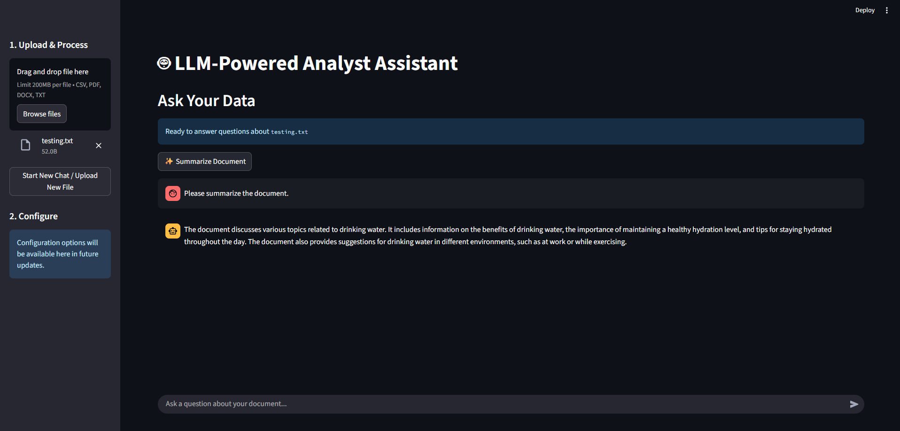

# analyst-assistant-ai

### A local, private, and powerful LLM-based assistant that analyzes your documents and returns insightful summaries, answers, and visualizations.

### 🔧 Core Features

- **Multi-Format File Upload:** Ingest and analyze `.csv`, `.pdf`, `.docx`, and `.txt` files.
- **Automated Knowledge Extraction:** Documents are automatically parsed, chunked, and vectorized for the LLM to understand.
- **Private, Local RAG Pipeline:** All processing is done locally. No calls to external APIs like OpenAI, ensuring 100% data privacy.
- **Conversational Q&A:** Ask questions about your data in plain English and get cited answers.
- **Dynamic Insights:** The assistant provides:
  - **Direct Answers:** With citations from the source document.
  - **Full Summaries:** Get a high-level overview of your file's content with one click.
  - **Chart Generation:** Asks for a comparison? Get a bar, line, or pie chart automatically.
  - **Next-Step Suggestions:** The assistant suggests relevant follow-up questions to guide your analysis.

---

### 🔥 Tech Stack

- **Orchestration:** [LangChain](https://www.langchain.com/) for structuring the RAG pipeline.
- **LLM Backend:** Local models from [HuggingFace](https://huggingface.co/) (e.g., `TinyLlama`, `Mistral-7B`). The demo uses `TinyLlama` for speed.
- **Vector Store:** [ChromaDB](https://www.trychroma.com/) for efficient, local similarity search.
- **Frontend:** [Streamlit](https://streamlit.io/) for a fast, interactive web UI.
- **Model Runner:** [CTransformers](https://github.com/marella/ctransformers) for efficient GGUF model inference on CPU.
- **Document Parsing:** `PyMuPDF` for PDFs, `python-docx` for Word documents, and `Pandas` for CSVs.

### 🧠 Engineering & Architecture

The application is built around a custom Retrieval-Augmented Generation (RAG) pipeline:

1.  **Ingestion:** When a user uploads a file, it is saved locally. A parser specific to the file type (e.g., `csv_parser`) extracts the text content. Tabular data from CSVs is converted into sentence-like rows to provide context.
2.  **Chunking & Embedding:** The extracted text is split into smaller, manageable chunks using a `RecursiveCharacterTextSplitter`. Each chunk is then converted into a numerical vector (embedding) using a sentence-transformer model (`all-MiniLM-L6-v2`) and stored in a local ChromaDB database.
3.  **Retrieval:** When a user asks a question, the query is also embedded. ChromaDB performs a similarity search to retrieve the most relevant text chunks from the database.
4.  **Augmentation & Generation:** The retrieved chunks are injected into a sophisticated prompt template along with the user's question. This "augmented" prompt is then sent to the local LLM (e.g., `TinyLlama`), which generates a final answer based only on the provided context.
5.  **Chart Generation Logic:** A special instruction in the prompt allows the LLM to decide if a query is best answered with a chart. If so, it outputs a structured JSON object, which the Python backend then uses to generate and display a visualization with Matplotlib.
